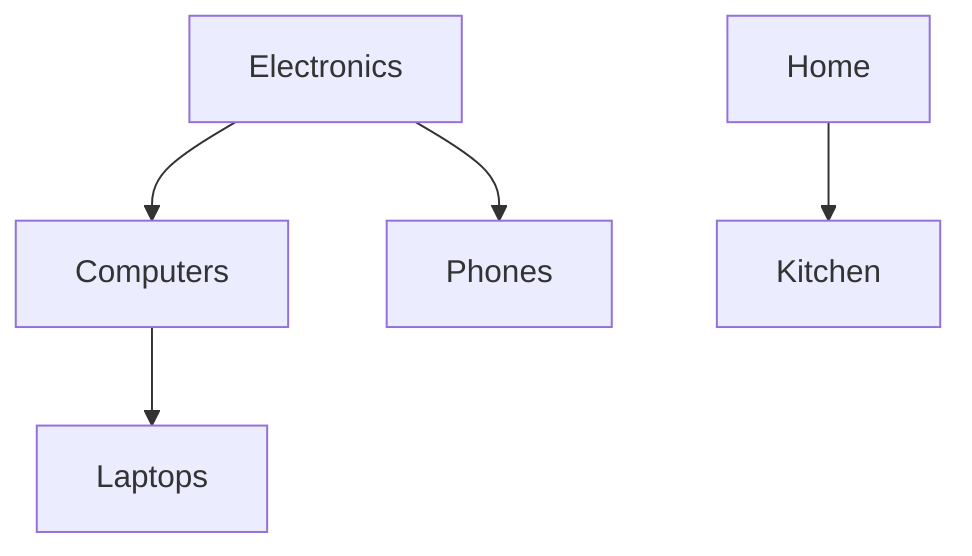
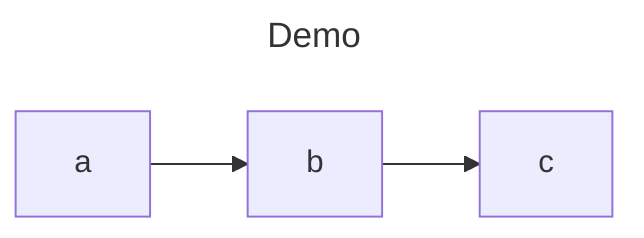

# ltree2mmd

Turn a Postgres [`ltree`](https://www.postgresql.org/docs/current/ltree.html) hierarchy into a
[Mermaid](https://mermaid.js.org/) flowchart — or a self-contained interactive HTML page.

```console
$ printf 'Electronics\nElectronics.Computers\nElectronics.Computers.Laptops\nElectronics.Phones\nHome\nHome.Kitchen\n' | ltree2mmd -
flowchart TD
    n0["Electronics"]
    n1["Computers"]
    n2["Laptops"]
    n3["Phones"]
    n4["Home"]
    n5["Kitchen"]
    n0 --> n1
    n1 --> n2
    n0 --> n3
    n4 --> n5
```



## Install

```sh
cargo install ltree2mmd
```

Prebuilt binaries for macOS (arm64, x64), Linux (x64, arm64), and Windows (x64) are attached to
every [release](https://github.com/Orbasker/ltree2mmd/releases). To install the latest one:

```sh
# macOS / Linux
curl --proto '=https' --tlsv1.2 -LsSf https://github.com/Orbasker/ltree2mmd/releases/latest/download/ltree2mmd-installer.sh | sh
```

```powershell
# Windows
powershell -c "irm https://github.com/Orbasker/ltree2mmd/releases/latest/download/ltree2mmd-installer.ps1 | iex"
```

## Usage

Three ways to run it:

```sh
ltree2mmd --table catalog     # render a table from the database
ltree2mmd tables              # list the ltree columns to choose from
ltree2mmd -                   # render newline-delimited paths from stdin
```

### From a database

```sh
export DATABASE_URL=postgres://user@localhost/shop

# Discover what there is to render. Output is schema.table.column, one per line.
ltree2mmd tables
# public.catalog.path

# Render it. The ltree column is auto-detected when the table has exactly one.
ltree2mmd --table catalog

# A schema-qualified table, one subtree, two levels deep, laid out left-to-right,
# labelled from a "name" column, written to a file as a fenced markdown block.
ltree2mmd --table store.catalog \
  --root Electronics --depth 2 \
  --label-column name \
  --direction LR --format md -o tree.md
```

Connection details are resolved in this order:

1. `--dsn`
2. `DATABASE_URL`
3. the libpq environment variables (`PGHOST`, `PGPORT`, `PGUSER`, `PGPASSWORD`, `PGDATABASE`)

The session is opened read-only (`BEGIN READ ONLY`) with a 30-second `statement_timeout` and a
pinned `search_path`, and TLS is negotiated against the platform's native trust store — so managed
providers like Neon, Supabase, and RDS work without extra flags.

### From stdin

No database needed — one path per line, blank lines ignored:

```sh
printf 'a\na.b\na.b.c\n' | ltree2mmd - --title Demo --direction LR --format md
```



### Interactive HTML

```sh
ltree2mmd --table catalog --format html -o tree.html
```

A single file with no external assets: click a node to collapse or expand its subtree.

## Options

| Flag | Default | What it does |
| --- | --- | --- |
| `-` | | Read newline-delimited paths from stdin instead of a database |
| `--dsn <DSN>` | `$DATABASE_URL` | Postgres connection string |
| `-t, --table <TABLE>` | | Table holding the hierarchy, optionally schema-qualified |
| `-c, --path-column <COL>` | auto-detected | Column of type `ltree`; required only when the table has more than one |
| `-l, --label-column <COL>` | last path label | Column to display in each node |
| `-r, --root <PATH>` | | Restrict output to this subtree |
| `--depth <N>` | | Levels to include below the root |
| `--direction <DIR>` | `TD` | Flow direction: `TD`, `LR`, `BT`, `RL` |
| `--max-nodes <N>` | `300` | Cap on total nodes; the rest are dropped and reported |
| `--max-children <N>` | `20` | Siblings beyond this fold into a single `+N more` node |
| `--no-synthesize` | | Drop rows with missing ancestors instead of inferring them |
| `--title <TITLE>` | | Title shown above the diagram |
| `-o, --output <PATH>` | stdout | Write to a file instead of stdout |
| `-f, --format <FMT>` | `mermaid` | `mermaid` (raw), `md` (fenced block), or `html` (interactive page) |

`--root` and `--depth` are pushed down into SQL, so a subtree of a large table only transfers the
rows it needs.

## Behaviour worth knowing

- **stdout is only ever the document.** Warnings, truncation notices, and errors all go to stderr,
  so `ltree2mmd --table t | pbcopy` and `-o out.mmd` stay clean.
- **Missing ancestors are synthesized.** If a row has path `a.b.c` but `a.b` is absent, `a.b` is
  inferred and a warning is printed. `--no-synthesize` drops such rows instead.
- **Big graphs are truncated, not silently mangled.** Past `--max-children`, extra siblings fold
  into one `+N more` node; past `--max-nodes`, the remainder is dropped. Either way a summary lands
  on stderr:

  ```
  truncated: folded 27 sibling(s) into "+N more" nodes
  ```

- **`--format html` ignores the limits** and renders the full tree, because the page collapses
  interactively.
- **Node ids are positional** (`n0`, `n1`, …), never derived from labels, so labels containing
  Mermaid reserved words, quotes, or brackets can't corrupt the diagram.

## Requirements

- Postgres with the `ltree` extension installed (any schema — it does not need to be on your
  `search_path`).
- Rust 1.85 or newer to build from source.

## Contributing

See [CONTRIBUTING.md](CONTRIBUTING.md).

## Licence

Dual-licensed under either of

- Apache License, Version 2.0 ([LICENSE-APACHE](LICENSE-APACHE))
- MIT license ([LICENSE-MIT](LICENSE-MIT))

at your option.

Unless you explicitly state otherwise, any contribution intentionally submitted for inclusion in
this crate by you, as defined in the Apache-2.0 licence, shall be dual-licensed as above, without
any additional terms or conditions.
